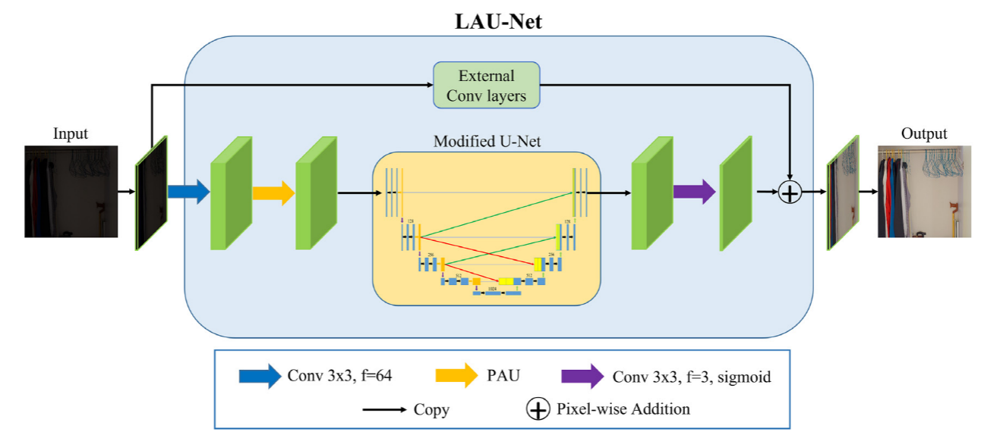

# Signal Processing: Image Communication LAU-Net: A low light image enhancer with attention and resizing mechanisms

This repository contains my reproduction implementation of the paper ***LAU-Net: A low light image enhancer with attention and resizing mechanisms***


[link to the paper](https://www.sciencedirect.com/science/article/abs/pii/S092359652300053X)


## Abstract
Nighttime environments with sub-optimal lighting conditions significantly degrade the quality of captured
images. Even though many notable state-of-the-art methods had been proposed to enhance low-light images,
many of the enhanced outcomes exhibit color distortion, and uneven light adjustment problems. To remedy
these issues, we propose an effective supervised network, Low-light Advanced U-Net (LAU-Net), which
restructures the regular U-Net to offer a better network for low-light image enhancement. Specifically, we
merged several efficacious components into our LAU-Net, namely the Parallel Attention Unit (PAU), the Internal
Resizing Module (IRM), and external convolutional layers. The PAU places two attention modules in parallel
to extract features along the convolutional streams. Meanwhile, the IRM comprises resizing components to
optimize the information flow from encoder blocks to decoder blocks, whereas the external convolutional
layers simulate the autoencoder to suppress noises. We employed the LOL dataset, which is composed of 500
paired images, to train, validate, and test the proposed network. Rigorous experiments showed that our model
delivered remarkable performance both in qualitative and quantitative assessments and outperforms state-of-
the-art approaches. Moreover, ablation studies also justified the necessity of each module in our proposed
design. Lastly, we demonstrated that the proposed method could serve as an excellent pre-processing tool for
image classification tasks in challenging nighttime environments, as it has successfully improved the object
classification accuracy of a ResNet-50 model when applied onto low-light images from the ExDark dataset.


## pipline


## Model Training

Run the following commands:
```
python3  train.py 
```
The weights results will be saved in ./LAUNET_checkpoints/LAUNet_LUIE/models

***make sure the training.yaml is correct***


## Model Testing

Run the following commands:
```
python3  demo.py 
```
The  results will be saved in ./results


